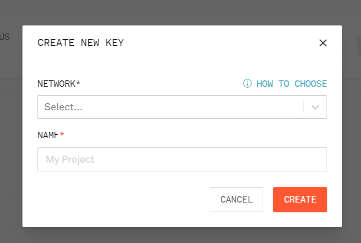
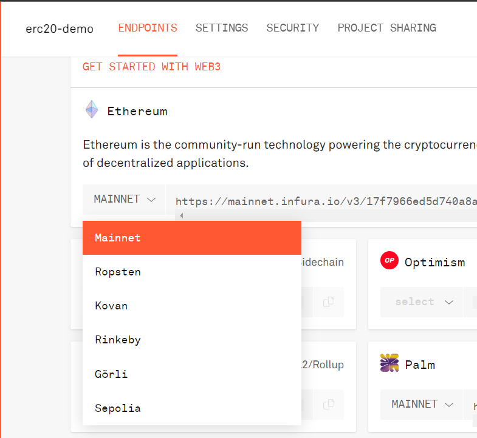
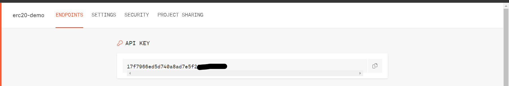

# ERC Token
# I. Prepare
### 1. Set up project
- Install necessary packages    
``` sh
$ cd sources
```
```sh
$ npm install
```
```sh
$ npm install -g truffle
```    


- Create file **.env** and copy content from file **.localenv** to .env
- Fill to fields in env file (with PROJECT_ID please follow below)
- Install Solidity extension in  Visual Studio Code
- Insert this lines below to setting.js in Visual Studio Code
```js
  "solidity.packageDefaultDependenciesContractsDirectory": "",
  "solidity.packageDefaultDependenciesDirectory": "sources/node_modules",
```
### 2. Deploying to public network: Create Infura account to get Project ID
- Go to [Infura.io](https://infura.io/resendverify) to create account
- Create new project    

    

- Choose network to get providerURL    

    

- Get project ID: click button **Manage Key** and go to project    



### 3. Deploying to local network
- Install Ganache-CLI
```sh
$ npm install -g ganache-cli
```
## II. Starting
### 1. Configuration
With file **./sources/truffle-config.js**
- Local network for development
```js
module.exports = {
    networks: {
        development: {
            host: "127.0.0.1",     // Localhost (default: none)
            port: 8545,            // Standard Ethereum port (default: none)
            network_id: "*",       // Any network (default: none)
    },
    }
}
```
- External network for testing or releasing
```js
module.exports = {
    networks: {
        ropsten: { // ropsten is alias for network name
            provider: () => new HDWalletProvider(MNEMONIC,`${PROVIDER_URL}${PROJECT_ID}`), // using HDWallet to matching provider, MNEMONIC is private key
            network_id: 3,      // chain id 
            gas: 30000000,      // gas limit < 4M
        }
    }
}
```
2. Executing    
2.1 Deploy to local with Ganache

- Check accounts in Ganache
```sh
$ ganache-cli
ganache v7.4.3 (@ganache/cli: 0.5.3, @ganache/core: 0.5.3)
Starting RPC server

Available Accounts
==================
(0) 0x04420B8C2576863722B081CF3B808E6B6C346DB3 (1000 ETH)
(1) 0x418a10C889f4aA54F6D02c4F015018B081eBbC98 (1000 ETH)
(2) 0x24E0d94a8d76be400578d67133BA32E7d970f4d9 (1000 ETH)
(3) 0x0675b79dC1026A4fCAF3F93BAFBc337893BEeCFA (1000 ETH)
(4) 0x906f1ea3e24A0714Fb520c8cd9073f2b139d98b0 (1000 ETH)
(5) 0xEc1D09B4180aB5F873c2b1c066Cd19Dd8E884649 (1000 ETH)
(6) 0x9b27d4aFac0B68fa55E447a38dFA08c3180F2990 (1000 ETH)
(7) 0x34b4b3bBaB0fF7833FbcB710662dc3728e940ff1 (1000 ETH)
(8) 0x5638229A69470E4Ba3aCC17889fa50059e6c76dd (1000 ETH)
(9) 0x4ceCd32Fc27D32268D30b37AA240764300B321EE (1000 ETH)

Private Keys
==================
(0) 0x9ee79ca3a911796c7abeae8d12e84f195d36cf60c072092ef533c2319ed7ba10
(1) 0xd155a43bc3405a94a8e007617a0f44757b4a260db6eeb2821cd9fef1dfc5f03e
(2) 0x503311b9529a38fc117570823ddc9b175b4a9b0d9641e8bb6f74db4c2e4d5601
(3) 0xf5746cb8e2c7effedcaea818f70975720d4caba7eba34587c7339097e08f4ac6
(4) 0x62331544204c263a62ed1b322fca4bba7a7fa0b9b989673e387ba08461415bcf
(5) 0xa2ce2e5b7e288d0e0a78fbbf3cead39953f3c460a05b1b55b7dc1534998f225b
(6) 0x7074feeba3a6e3b59c07d285ca87ed558375c09fe1c8b547bc469d49a0181cf6
(7) 0x689b1851a72eff7e37db9b097ebbc95ef3866e285401ecb26f8d8314ef458df6
(8) 0x80af52a3d298248e2ad0b691ead4f80236c5bd62386f74ea8c524fb96ee0b3e6
(9) 0xe4b2a78b3dfb18b6a768d072d9ff64f12d30f9bd1b719e02cd1f7ee423e8f667

HD Wallet
==================
Mnemonic:      loud stadium true dizzy peace sea suggest oven swear brown true sorry
Base HD Path:  m/44'/60'/0'/0/{account_index}

Default Gas Price
==================
2000000000

BlockGas Limit
==================
1337

RPC Listening on 127.0.0.1:8545
```
- Truffle will use ```account[0]``` to deploy contract to local network. If you face error like *"unlock account"* you can run this command to resolve it
```sh
$ ganache-cli --secure --unlock <account or index accout>
```
- Deploying: open new terminal and run
```sh
$ truffle migrate --network development
```
result:
```console
$ truffle migrate --network development

Compiling your contracts...
===========================
> Compiling .\contracts\ERC20\Swan.sol
> Compiling .\contracts\ERC721\Turing.sol
> Compiling openzeppelin-solidity\contracts\token\ERC20\ERC20.sol
> Compiling openzeppelin-solidity\contracts\token\ERC20\IERC20.sol
> Compiling openzeppelin-solidity\contracts\token\ERC20\extensions\IERC20Metadata.sol
> Compiling openzeppelin-solidity\contracts\token\ERC721\ERC721.sol
> Compiling openzeppelin-solidity\contracts\token\ERC721\IERC721.sol
> Compiling openzeppelin-solidity\contracts\token\ERC721\IERC721Receiver.sol
> Compiling openzeppelin-solidity\contracts\token\ERC721\extensions\IERC721Metadata.sol
> Compiling openzeppelin-solidity\contracts\utils\Address.sol
> Compiling openzeppelin-solidity\contracts\utils\Context.sol
> Compiling openzeppelin-solidity\contracts\utils\Strings.sol
> Compiling openzeppelin-solidity\contracts\utils\introspection\ERC165.sol
> Compiling openzeppelin-solidity\contracts\utils\introspection\IERC165.sol
> Artifacts written to D:\Training\ERC-Token\sources\build\contracts
> Compiled successfully using:
   - solc: 0.8.1+commit.df193b15.Emscripten.clang


Starting migrations...
======================
> Network name:    'development'
> Network id:      1663726699381
> Block gas limit: 30000000 (0x1c9c380)


1_deploy_contracts.js
=====================

   Replacing 'Swan'
   ----------------
   > transaction hash:    0x1505b995743d1a12cd974027ff56487d3409f6768ea400d5f73032bb6f9200aa
   > Blocks: 0            Seconds: 0
   > contract address:    0xB313A9EB4854A6C74465a51f5c5323649369fb71
   > block number:        3
   > block timestamp:     1663726833
   > account:             0x5fD597308E750F7a8f06cbb0A4C0E3f132ABCf64
   > balance:             999.985128110840348378
   > gas used:            1511219 (0x170f33)
   > gas price:           3.189344432 gwei
   > value sent:          0 ETH
   > total cost:          0.004819797903182608 ETH

   > Saving artifacts
   -------------------------------------
   > Total cost:     0.004819797903182608 ETH

Summary
=======
> Total deployments:   1
> Final cost:          0.004819797903182608 ETH
```
2.1 Deploy to external network

- Recheck private key, provider url, project id, network id, ...
- Run this command to deploy:
```sh
$ truffle migrate --network <network name in truffle-config.js>
```
- Result
```console
$ truffle migrate --network ropsten

Compiling your contracts...
===========================
> Compiling .\contracts\ERC20\Swan.sol
> Compiling .\contracts\ERC721\Turing.sol
> Compiling openzeppelin-solidity\contracts\token\ERC20\ERC20.sol
> Compiling openzeppelin-solidity\contracts\token\ERC20\IERC20.sol
> Compiling openzeppelin-solidity\contracts\token\ERC20\extensions\IERC20Metadata.sol
> Compiling openzeppelin-solidity\contracts\token\ERC721\ERC721.sol
> Compiling openzeppelin-solidity\contracts\token\ERC721\IERC721.sol
> Compiling openzeppelin-solidity\contracts\token\ERC721\IERC721Receiver.sol
> Compiling openzeppelin-solidity\contracts\token\ERC721\extensions\IERC721Metadata.sol
> Compiling openzeppelin-solidity\contracts\utils\Address.sol
> Compiling openzeppelin-solidity\contracts\utils\Context.sol
> Compiling openzeppelin-solidity\contracts\utils\Strings.sol
> Compiling openzeppelin-solidity\contracts\utils\introspection\ERC165.sol
> Compiling openzeppelin-solidity\contracts\utils\introspection\IERC165.sol
> Artifacts written to D:\Training\ERC-Token\sources\build\contracts
> Compiled successfully using:
   - solc: 0.8.1+commit.df193b15.Emscripten.clang


Migrations dry-run (simulation)
===============================
> Network name:    'ropsten-fork'
> Network id:      3
> Block gas limit: 30000000 (0x1c9c380)


1_deploy_contracts.js
=====================

   Replacing 'Swan'
   ----------------
   > block number:        13018811
   > block timestamp:     1663727503
   > account:             0x03b6A3df5464aa5EA0A332be96572BC1337B851e
   > balance:             11.488049905216376052
   > gas used:            1511219 (0x170f33)
   > gas price:           2.500000007 gwei
   > value sent:          0 ETH
   > total cost:          0.003778047510578533 ETH

   -------------------------------------
   > Total cost:     0.003778047510578533 ETH

Summary
=======
> Total deployments:   1
> Final cost:          0.003778047510578533 ETH
```
